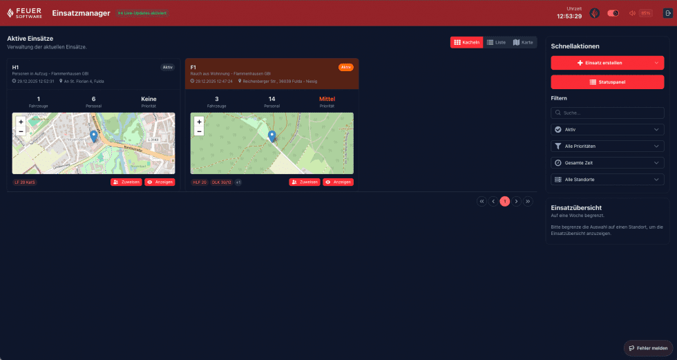

# Einsatzübersicht (Dashboard)

Nach der Anmeldung gelangt der Benutzer direkt zur **Einsatzübersicht**. Diese ist die zentrale Anlaufstelle des EinsatzManagers und zeigt alle laufenden sowie abgeschlossenen Einsätze der Organisation.

---

## Anzeigemodi

Die Einsätze können in drei verschiedenen Ansichten dargestellt werden:

### Kachelansicht

Die Standardansicht zeigt jeden Einsatz als Kachel. Jede Kachel enthält:
- Farblich hinterlegtes Stichwort
- Adresse und Ortsteil
- Priorität (Ampelfarbe)
- Zeitstempel (Beginn und Laufzeit)
- Anzahl alarmierter Einheiten

### Listenansicht

Die Listenansicht stellt alle Einsätze in einer kompakten Tabelle dar. Eignet sich besonders für Bildschirme mit vielen gleichzeitigen Einsätzen.

### Kartenansicht

Die Kartenansicht zeigt bis zu 50 Einsätze geografisch auf einer OpenStreetMap-Karte. Einsätze werden als farbige Marker dargestellt; ein Klick öffnet eine Kurzübersicht.

---

## Filter & Suche

Auf der linken Seite befinden sich die Schnellfilter (Quick Actions), mit denen die Anzeige gezielt eingeschränkt werden kann.

| Filter | Optionen |
|---|---|
| Status | Aktiv, Abgeschlossen |
| Priorität | Keine, Niedrig, Mittel, Hoch |
| Zeitraum | Letzte Stunde, Heute, Benutzerdefiniert |
| Standort | Auswahl eines Standorts / Wache |
| Freitextsuche | Durchsucht Stichwort, Sachverhalt und Adresse |

> **Standardfilter:** Beim Aufruf des Dashboards werden automatisch die **aktiven Einsätze** des letzten Jahres angezeigt.

Alle Filter lassen sich kombinieren. Die Einstellungen bleiben beim Wechsel des Anzeigemodus erhalten.

> **Hinweis:** Sollten hier viele alte Einsätze angezeigt werden, liegt dies daran, dass diese Einsätze nicht geschlossen wurden bzw. keinen Einsatzende-Zeitstempel besitzen. Alte Einsätze können über das **Connect-Portal** geschlossen werden. Zukünftig wird eine Funktion implementiert, mit der Einsätze automatisch nach einer definierten Zeit geschlossen werden.

---

## Echtzeit-Aktualisierung

Das Dashboard empfängt Einsatzmeldungen in Echtzeit über eine WebSocket-Verbindung (SignalR). Der aktuelle Verbindungsstatus wird oben rechts angezeigt:

- **„Live-Aktualisierungen aktiviert"** (grün) – neue und geänderte Einsätze erscheinen automatisch
- **„Live-Aktualisierungen deaktiviert"** (rot) – Verbindung unterbrochen, Seite manuell neu laden

---

## Einsatzstatistiken

Über der Einsatzliste werden Kurzstatistiken angezeigt, z. B.:
- Anzahl aktiver Einsätze
- Gesamtanzahl der Einsätze im gewählten Zeitraum

---

## Navigation zu einem Einsatz

Ein Klick auf eine Kachel, eine Tabellenzeile oder einen Kartenmarker öffnet die **Einsatzdetailseite** des jeweiligen Einsatzes.
