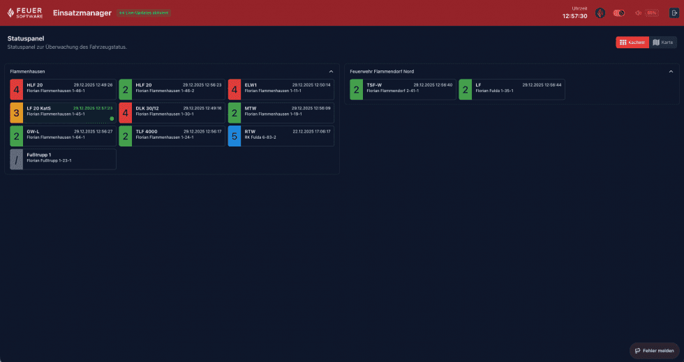

# Statuspanel

Das **Statuspanel** bietet eine permanente Echtzeit-Übersicht aller Fahrzeuge der Organisation. Es ist besonders für die Leitstelle oder einen dedizierten Bildschirm in der Wache konzipiert.

Das Statuspanel ist über den Menüpunkt **„Statuspanel"** in der Hauptnavigation erreichbar.

---

## Anzeigemodi

### Kachelansicht (Standard)

Fahrzeuge werden nach Standorten / Wachen gruppiert in einer Kacheldarstellung angezeigt. Das Layout verteilt die Fahrzeuge automatisch auf zwei Spalten und gleicht die Höhe aus.

Jede Fahrzeugkachel zeigt:
- Fahrzeugbild
- Rufname und Fahrzeugbezeichnung
- Aktueller Funkstatus (farblich codiert)
- Letzter GPS-Zeitstempel

### Kartenansicht

Die Kartenansicht stellt alle Fahrzeuge mit ihren aktuellen GPS-Positionen auf einer Karte dar. Farbige Marker entsprechen dem Funkstatus der Fahrzeuge.

---

## Funkstatus-Farbkodierung

Der Funkstatus der Fahrzeuge wird durch Farben visuell unterschieden:

| Farbe | Bedeutung (typisch) |
|---|---|
| Grün (hell) | Einsatzbereit / Wache |
| Grün | Auf Anfahrt |
| Gelb | Am Einsatzort |
| Rot | Nicht verfügbar |
| Blau | Sonderfahrt |
| Lila | Besonderer Status |
| Grau | Status unbekannt |
| Weiß | Kein Signal |

Die genaue Bedeutung der Statuscodes hängt von der Konfiguration der Organisation im Connect-Portal ab.

---

## Echtzeit-Aktualisierung

Das Statuspanel empfängt alle Statusänderungen und Positionsupdates in Echtzeit über SignalR:

- **Statuswechsel** eines Fahrzeugs werden sofort visuell dargestellt
- **Neue GPS-Positionen** aktualisieren den Zeitstempel und die Kartenposition
- **Akustische Benachrichtigungen** – optional konfigurierbar; ein Signalton ertönt bei relevanten Statusänderungen

Der Live-Verbindungsstatus wird analog zur Einsatzübersicht über ein farbiges Badge angezeigt.

---

## Besatzungsinformationen

Sofern vom Fahrzeug übermittelt, werden Besatzungsdaten angezeigt:
- Anzahl der Einsatzkräfte an Bord
- Zugewiesene Funktionen (Fahrer, Maschinist, etc.)
- Anzahl Atemschutzgeräteträger (AGT)

---

## Standort-Gruppierung

Fahrzeuge werden automatisch ihrem konfigurierten Standort zugeordnet und in der Kachelansicht unter dem jeweiligen Standortnamen gruppiert angezeigt. Die Konfiguration der Standorte erfolgt im Connect-Portal.
